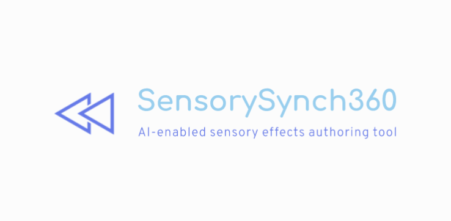

## Overview

SensorySynch360 is a comprehensive system for creating multisensory experiences in 360-degree videos through a hybrid approach combining AI-powered automatic detection with human authoring capabilities. The system enables users to add sensory effects (wind, heat, cold, vibration, aroma, light) to specific locations and time intervals within 360° video content.

## Architecture

The system implements a microservices architecture with four primary subsystems:

### Frontend Layer

  * **Editor Interface**: Web-based application built on PANOLENS.js and Three.js for 360° video visualization
  * **Presentation System**: Tutorial and walkthrough interface using Reveal.js

### Backend Processing

  * **Web Server API**: Flask-based API server for orchestrating the processing pipeline
  * **Inference Engine**: AI modules for object detection and scene understanding
  * **Effect Generation**: Pipeline converting detected labels into structured sensory effects

### Infrastructure Services

  * **Message Broker**: RabbitMQ for asynchronous module communication
  * **Data Store**: Redis for caching and temporary data storage
  * **Media Storage**: AWS S3 for video and media assets

## Key Features

  * **360° Video Processing**: Converts equirectangular videos into frame sequences for AI analysis
  * **Multi-Modal AI Detection**: Specialized modules for fire, objects, scenes, and sun localization
  * **Spatial Effect Mapping**: Converts AI detections into spatially-aware sensory effects
  * **Interactive Timeline Editor**: Visual interface for refining automatically generated effects
  * **Real-time Processing**: Asynchronous pipeline with status monitoring
  * **Containerized Deployment**: Docker-based microservices with development and production configurations

## Technology Stack

### Frontend

  * HTML5 + Tailwind CSS + DaisyUI
  * JavaScript ES6 Modules
  * Three.js + PANOLENS.js for 360° rendering
  * Custom timeline component for temporal editing

### Backend

  * Flask web framework with uWSGI
  * Pika RabbitMQ client for message processing
  * Redis Python client for data storage
  * Boto3 AWS SDK for S3 integration

### AI/ML Stack

  * AWS Rekognition for general object detection
  * YOLOv4 models for specialized detection (fire)
  * Clarifai API for scene understanding
  * OpenCV + NumPy for computer vision processing

### Infrastructure

  * Docker containers with GPU support
  * AWS ECS for production deployment
  * RabbitMQ message broker
  * Redis cache and storage

## Getting Started

### Prerequisites

  * Docker and Docker Compose
  * NVIDIA Docker runtime (for GPU-accelerated modules)
  * AWS credentials for S3 and Rekognition services
  * Environment variables configured in `.env` file

### Development Setup

```bash
git clone https://github.com/raphael-abreu/SensorySynch360.git
cd SensorySynch360/app
docker-compose -f docker-compose-dev.yml up
```

The system will be available at:

  * Editor Interface: http://localhost:80
  * API Server: http://localhost:8007
  * RabbitMQ Management: http://localhost:15672

### Production Deployment

```bash
docker-compose -f docker-compose-prod.yml up
```

## System Components

### AI Inference Modules

| Module         | Purpose                   | Technology                    |
| -------------- | ------------------------- | ----------------------------- |
| `aws-module`   | General object detection  | AWS Rekognition + YOLO        |
| `fire-module`  | Fire detection            | YOLOv4 specialized model      |
| `scene-module` | Scene understanding       | Clarifai API                  |
| `sun-module`   | Sun localization          | Computer vision algorithms    |

### Effect Types

The system supports the following sensory effects:

  * **Heat**: Temperature-based effects with intensity control
  * **Cold**: Cooling effects with ambient override logic
  * **Wind**: Directional airflow with spatial propagation
  * **Aroma**: Scent effects with type specification
  * **Vibration**: Tactile feedback effects
  * **Light**: Visual lighting effects

### Processing Pipeline

1.  **Video Upload**: User uploads 360° video through the editor interface
2.  **Frame Extraction**: System converts video to equirectangular frame sequences
3.  **AI Processing**: Specialized modules analyze frames for different detection targets
4.  **Effect Generation**: Labels are converted to sensory effects using mapping rules
5.  **Timeline Creation**: Effects are organized into temporal sequences
6.  **Manual Refinement**: Users can adjust effects through the visual editor

## API Endpoints

### Core Endpoints

  * `POST /api/upload_video`: Upload and process 360° video
  * `GET /api/get_modules_status`: Check processing status of AI modules
  * `POST /api/labels_2_sensory_effects`: Convert detected labels to sensory effects

## Configuration

### Environment Variables

  * `AWS_ACCESS_KEY_ID`: AWS credentials for S3 and Rekognition
  * `AWS_SECRET_ACCESS_KEY`: AWS secret key
  * `S3_BUCKET_NAME`: S3 bucket for media storage
  * `RABBITMQ_URL`: RabbitMQ connection string
  * `REDIS_URL`: Redis connection string

### Effect Mapping Configuration

The system uses configurable mapping dictionaries to convert AI detection labels into sensory effects with customizable intensity, propagation, and spatial properties.

## Development

### Project Structure

```
app/
├── editor/                # Frontend editor interface
│   ├── js/                # JavaScript modules
│   ├── css/               # Stylesheets and vendor CSS
│   └── index.html         # Main editor page
├── pipeline/              # Backend processing system
│   ├── app.py             # Flask API server
│   ├── inference/         # AI processing modules
│   └── rmq-consumer/      # Message queue consumer
├── presentation/          # Tutorial and presentation system
├── docker-compose-dev.yml # Development configuration
└── docker-compose-prod.yml# Production configuration
```

### Adding New AI Modules

1.  Inherit from `BaseRecognitionModule`
2.  Implement `pre_process()`, `inference()`, and `module_request_callback()` methods
3.  Add module configuration to Docker Compose files
4.  Register module in the message processing system
